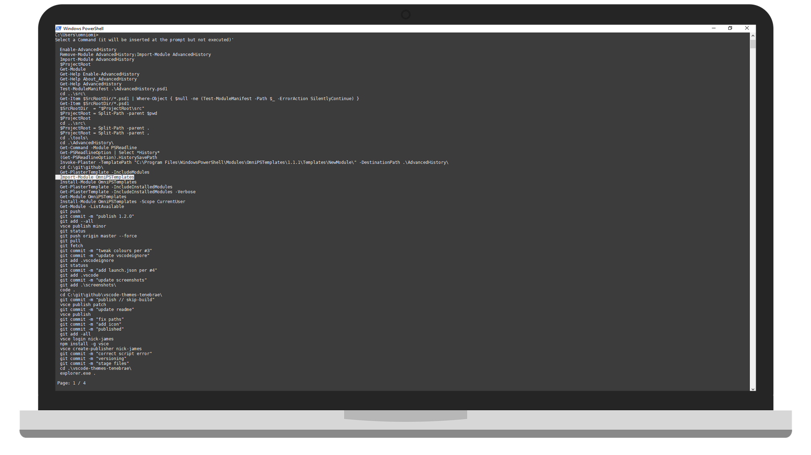

# AdvancedHistory

Add keyboard navigable and filterable history to Windows PowerShell and PowerShell Core. Once an item is selected the menu is cleared from the console but your buffer is not erased meaning you can still scroll up and view previously executed commands.



## Setup

### Installation

#### Install from PSGallery

```PowerShell
Install-Module OmniPSTemplates -Scope CurrentUser
```

#### Install from Source

```PowerShell
git clone https://github.com/omniomi/AdvancedHistory.git
cd .\AdvancedHistory\tools
.\Build.ps1 Install
```

### Enable AdvancedHistory

The easiest way to ensure that AdvancedHistory is always available is to add it to your [$PROFILE](https://docs.microsoft.com/en-us/powershell/module/microsoft.powershell.core/about/about_profiles?view=powershell-5.0). Simply add these two lines anywhere in your PowerShell profile:

```PowerShell
Import-Module AdvancedHistory
Enable-AdvancedHistory
```

### Setting the Keyboard Shortcut

By default AdvancedHistory uses <kbd>F7</kbd> for accessing the history menu. To change the shortcut specify the key or keys as a string following `Enable-AdvancedHistory`. For example, to use <kbd>Ctrl</kbd>+<kbd>F7</kbd> you would use `Enable-AdvancedHistory 'Ctrl+F7'`

### Only Show Unique Command History

To only show unique commands from your history once (most recent execution) use the `-Unique` switch on `Enable-AdvancedHistory`.

### Override History Limit

By default the AdvancedHistory will limit 256 the menu to items whether unique or not. To override the limit set `$Global:HistoryCountOverride = <number>` either in your PowerShell Profile or at the CLI as needed. For example, `$Global:HistoryCountOverride = 512`

> NOTE: The history override must come before `Enable-AdvancedHistory`.
> ```PowerShell
> # $Profile
> Import-Module AdvancedHistory
> $Global:HistoryCountOverride = 512
> Enable-AdvancedHistory
> ```

## Usage

To access the AdvancedHistory meny press either <kbd>F7</kbd> or the keyboard shortcut you specified when setting it up.

### Navigation

* Up/Down Arrows: Navigate the list
* Right/Left Arrows: Change the page
* Enter/Return: Select the highlighted line item
* Esc: Cancel

### Filtering

To filter the search type any part of the command at the prompt before pressing the activation key.

```PowerShell
C:\> mkdir MyProject
C:\> cd .\MyProject\
C:\MyProject\> MyProj<F7>
Select a Command (it will be inserted at the prompt but not executed)

  cd .\MyProject\
  mkdir MyProject

 Page: 1 / 1
```

## Requirements

- Requires PSReadline (included in PowerShell >=5.0)